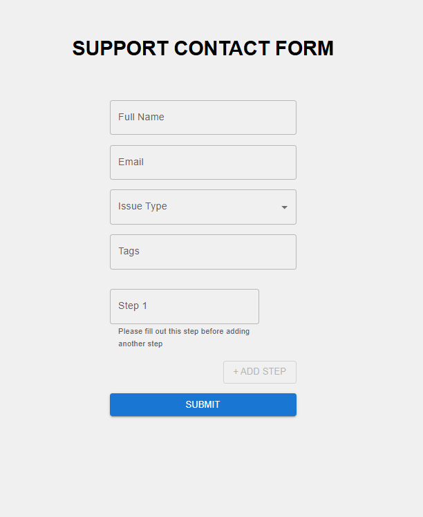

# Support Contact Form

A support contact form built with React, TypeScript, and Material-UI, using `react-hook-form` for form handling and validation with `zod` for schema-based validation. This form includes dynamic fields for "Steps to Reproduce," which allows adding/removing fields based on input, and uses Redux for state management.

## Table of Contents

- [Demo](#demo)
- [Features](#features)
- [Technologies Used](#technologies-used)
- [Project Setup](#project-setup)
- [Usage](#usage)
- [Project Structure](#project-structure)

## Demo

 <!-- Replace this with a link or path to a screenshot in your repo -->

## Features

- **Dynamic Form Fields**: Add/remove steps in the "Steps to Reproduce" section dynamically.
- **Validation**: Utilizes Zod for schema validation with real-time error messages.
- **Redux State Management**: Saves form data in a Redux store.
- **Material-UI**: A responsive and accessible UI with Material-UI components.
- **Conditional Button Behavior**: The "Add Step" button is disabled until the last step is filled.

## Technologies Used

- **React**: For UI.
- **TypeScript**: Ensures type safety.
- **React Hook Form**: Handles form state and validation.
- **Zod**: Schema-based validation.
- **Material-UI**: UI components.
- **Redux**: Manages global form data.
- **Vite**: Fast bundling and development server.
- **PNPM**: For package management.

## Project Setup

### Prerequisites

- [Node.js](https://nodejs.org/) (v14 or higher)
- [PNPM](https://pnpm.io/) (if not installed, install with `npm install -g pnpm`)

### Installation

1. **Clone the repository**:

   ```bash
   git clone https://github.com/Farazzaidi22/Support-Form.git
   cd support-contact-form
   ```

2. **Install dependencies**:

   ```bash
   pnpm install
   ```

3. **Run the development server**:

   ```bash
   pnpm dev
   ```

4. **Build for production**:

   ```bash
   pnpm build
   ```

5. **Run production server**:

   After building, you can preview the production build by running:

   ```bash
   pnpm preview
   ```

### Environment Setup (if applicable)

This project doesn’t require any environment variables for setup.

## Usage

### Running the Form Locally

1. After starting the development server, open [http://localhost:5173](http://localhost:5173) in your browser.
2. Fill out the form with appropriate values:
   - **Full Name** and **Email** fields are required.
   - **Issue Type** should be selected from the dropdown.
   - **Tags** can be selected or added freely.
   - **Steps to Reproduce**: Add as many steps as needed. The "Add Step" button will only enable when the previous step is filled.
3. Submit the form. The data is saved in Redux, and you’ll be redirected to a confirmation page displaying the submitted information.

### Code Overview

The project structure is designed for scalability and clarity.

#### Project Structure

```plaintext
support-contact-form
├── src
│   ├── components
│   │   ├── StepFieldArray.tsx    # Handles the dynamic "Steps to Reproduce" fields
│   │   └── ConfirmationPage.tsx  # Displays submitted data
│   ├── pages
│   │   └── FormPage.tsx          # Main form page
│   ├── store
│   │   ├── formSlice.ts          # Redux slice for managing form data
│   │   └── store.ts              # Redux store configuration
│   ├── types
│   │   └── types.ts              # Type definitions for the form data
│   ├── App.tsx                   # Root component with router setup
│   └── main.tsx                  # Entry point
├── README.md                     # Project documentation
├── index.html                    # HTML template
└── vite.config.ts                # Vite configuration
```

### Key Components

- **FormPage.tsx**: Main form component, which uses `react-hook-form` and Zod for validation. It includes fields for Full Name, Email, Issue Type, Tags, and dynamic Steps.
- **StepFieldArray.tsx**: A reusable component that renders dynamic fields for steps with validation logic to disable the "Add Step" button until the last field is filled.
- **ConfirmationPage.tsx**: Displays submitted data using the global state managed by Redux.

### Validation Logic

- **Required Fields**: Each field is validated through Zod's schema-based validation.
- **Dynamic Step Validation**: The "Steps to Reproduce" field array enforces that at least one step must be added. The "Add Step" button is disabled until the last field is filled.
- **Real-Time Validation**: The error message under each step field disappears in real-time as the user types.
